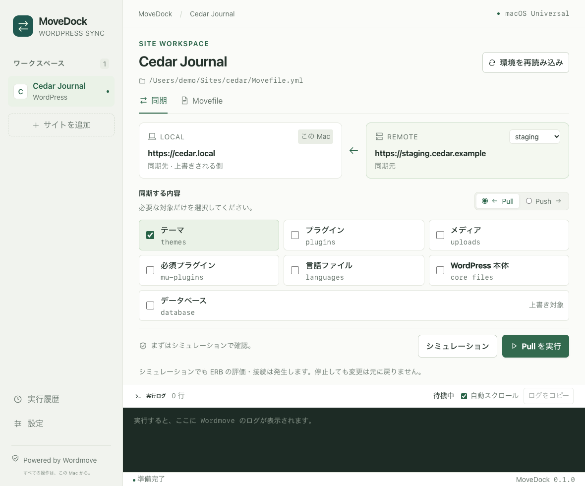

<p align="center"></p>
<h1 align="center">MoveDock</h1>
<p align="center">WordPress の同期を、ひとつのワークスペースで。<br />Rust · Tauri 2 · Vue 3 · macOS Universal</p>

Wordmove CLI を操作する、日本語の macOS デスクトップアプリです。Intel と Apple Silicon 両方のコードを含むユニバーサルアプリをビルドします。Nuxt や常駐バックエンドサーバーは使用しません。

Wordmove 本体とは独立したリポジトリです。同期処理には導入済みの CLI を使用し、[annrie/wordmove の Ruby 3 対応フォーク](https://github.com/annrie/wordmove)を Bundler 経由で利用できます。上流 Wordmove の公式アプリではありません。



## 機能

- Movefile を選択して複数サイトを登録、環境を選択
- Push / Pull、対象の個別選択、シミュレーション
- 実行直前の同期先・対象確認、リアルタイム stdout / stderr 表示
- 実行の停止（子プロセス群を含む）、二重実行の防止
- Movefile の新規作成・編集、外部変更の検出
- 実行履歴（最新 200 件、ログ本文は保存しません）
- Ruby / Bundler / Wordmove / SSH / rsync などの検出
- 実行ファイル、Gemfile、Ruby バージョン、追加 PATH の設定
- ライト・ダーク・システムテーマ

## 必要な環境

- macOS 11 以降（Intel / Apple Silicon）
- Wordmove と、それに対応する Ruby / Bundler
- 同期方式に応じて SSH、rsync、WP-CLI、PHP、MySQL クライアント。FTP は lftp

アプリの Universal 対応と、外部コマンドの導入は別です。Ruby / Wordmove / 外部コマンドは同梱しません。それぞれの Mac に適したものを導入してください。互換性フォークの導入は [Wordmove README](https://github.com/annrie/wordmove#日本語) を参照してください。

## 最初の設定

1. 初回起動時に Wordmove・Gemfile・rbenv の Ruby バージョン・必要な追加 PATH を自動入力して保存します。以前のバージョンで初期状態のままだった設定も対象です。保存済みの手入力は保持します。
2. **設定 → 実行環境を確認**で Wordmove が起動するか確認します。未導入の gem などはここで表示されます。自動入力だけでインストールや接続確認は行いません。
3. 見つからない項目だけ指定してください。導入後の「空欄を再検出」は、入力済みの値を保持して空欄を補完・保存します。未保存の変更がある間は再検出と確認を無効にします。
4. 「Movefile を開く」でサイトを登録します。内容を確認し、「環境を読み込む」で信頼した Movefile を評価します。
5. 環境・方向・対象を選び、まずシミュレーションを実行します。結果を確認してから同期を実行してください。

自動検出はファイルの存在とパスだけを調べ、Gemfile・Movefile・シェルの起動スクリプトを評価しません。Wordmove フォークはホーム配下の `work` / `Projects` / `projects` / `Developer` / `Code` / `src` にある `wordmove` を探索します。複数ある場合は選択を求めます。一つ見つかれば Bundler、見つからず Wordmove コマンドがある場合は直接実行を設定します。

PHP / MySQL が通常の PATH にない場合、Homebrew と Local の導入済みサービスを探索します。Local は導入済みの新しいバージョンを候補にします。サイト固有のバージョンが必要なら追加 PATH を変更してください。追加不要の場合は空欄のままで正常です。

既存 gem を使う場合は「Wordmove を直接実行」を選びます。GUI 起動時にも Homebrew / rbenv の一般的なパスを探索し、追加 PATH を優先します。`~/` は展開されます。実行ファイル欄にシェルコマンドや追加引数は入力しません。

Bundler モードは指定した Gemfile とその横の `.bundle/config` を利用します。rbenv の実行基準ディレクトリも合わせるため、フォークの `.ruby-gemset` を参照できます。Ruby や gem を切り替えた場合は、同じ環境で `bundle install` が成功することを確認してください。

## 実行時の扱い

- Movefile の ERB は Ruby コードです。サイト登録・アプリ起動だけでは評価せず、明示的な読み込み時に実行します。信頼できるファイルを使用してください。
- シミュレーションは Wordmove の `--simulate` を利用します。ERB の評価・接続が発生し得るため、完全に副作用がない操作ではありません。
- 停止はロールバックではありません。停止前に行われたファイル転送や DB 更新が残ることがあります。
- CLI の終了コードが 0 の場合を「正常終了」と表示します。Movefile の `forbid` でスキップした対象もあるため、ログを確認してください。
- SSH の対話入力は使用できません。SSH agent / 鍵認証、known_hosts、必要な接続設定を事前に確認してください。同期は最大 4 時間でタイムアウトします。
- Movefile を外部で変更した場合は再読み込みが必要です。設定保存や Movefile 編集後も環境を再読み込みします。
- 環境一覧には Wordmove の `list` 出力を使用します。リモート環境には `vhost` が必要です。ERB / .env の解決規則は利用する CLI に従います。
- ログは画面上で最新 2000 行を保持します。既知のパスワード表現を伏せますが、任意のフック出力に含まれる機密情報の完全な秘匿は保証しません。
- 新規 Movefile テンプレートは例示の接続先です。編集してから使用してください。初期状態でリモート DB への push を `forbid` で禁止しています。

設定・サイト・実行履歴は `~/Library/Application Support/com.annrie.movedock/settings.json` に保存します。Movefile の接続パスワードは設定ファイルへ複製しません。

## 開発

Node.js 22.12 以降、pnpm、Rust と Xcode Command Line Tools が必要です。

```sh
pnpm install
pnpm app:dev
```

ブラウザ上の見た目だけを確認する場合は `pnpm dev`（ポート 1425）。ブラウザではネイティブ操作は無効です。

```sh
pnpm build                # Vue 型チェック + Vite 本番ビルド
pnpm test                 # 同期フローのテスト
pnpm rust:test            # CLI 引数・実行・停止・変更検出のテスト
cargo fmt --manifest-path src-tauri/Cargo.toml --check
```

## 変更履歴・リリース

Conventional Commits（`feat:` / `fix:` / `docs:` など）から changelogen で変更履歴を生成します。分類は YTDown と同じ日本語の見出しを使用します。

```sh
pnpm changelog       # 変更履歴をプレビュー
pnpm release:patch   # 0.1.0 → 0.1.1
pnpm release:minor   # 0.1.0 → 0.2.0
pnpm release:major   # 0.1.0 → 1.0.0
```

リリース前に作業内容をコミットしてください。リリースコマンドは `CHANGELOG.md` を生成し、`package.json`・`Cargo.toml`・`Cargo.lock`・Tauri 設定のバージョンを揃え、ローカルのリリースコミットとタグを作成します。画面のバージョン表示も同じリリース処理で同期します。push・GitHub Release の公開は手動です。

## Universal ビルド

[Tauri の Universal ビルド](https://v2.tauri.app/distribute/app-store/)を利用します。

```sh
rustup target add aarch64-apple-darwin x86_64-apple-darwin
pnpm app:build
```

出力:

- `src-tauri/target/universal-apple-darwin/release/bundle/macos/MoveDock.app`
- `src-tauri/target/universal-apple-darwin/release/bundle/dmg/MoveDock_0.1.0_universal.dmg`

```sh
lipo -archs src-tauri/target/universal-apple-darwin/release/bundle/macos/MoveDock.app/Contents/MacOS/movedock
# x86_64 arm64
```

既定はローカル利用向けの ad-hoc 署名です。公開配布用の Developer ID 署名・公証は未設定です。

## 検証範囲

CLI の引数、標準出力・エラー出力、失敗終了、停止、タイムアウト、Movefile の変更検出とフロントエンドの確認フローを模擬 CLI / テストデータで検証します。実サイトへの Push / Pull は自動検証しません。ステージング環境でバックアップを取って確認してください。

## ライセンス

MIT。Wordmove 本体の著作権・ライセンスはそれぞれのリポジトリに従います。アプリの構成は [YTDown](https://github.com/annrie/YTDown) を参考にしています。
